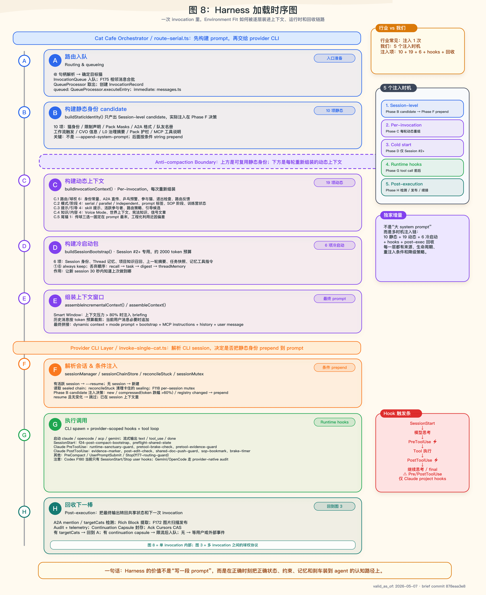

# Cat Cafe 架构图谱设计（三猫总汇）

> **一句话**：用 5 张图说清楚 Cat Cafe——1 张产品叙事 + 4 张 harness/技术切片。
>
> 本文是 2026-05-05 三猫并行独立思考后的收敛文档。每只猫各自提了方案（46 提 6 张、55 提 6 张、47 提 4 张），本文汇总分歧、找到共识、输出最终图谱。

---

## 一、三猫各自提了什么

### Ragdoll 46 — 6 张图，3 维度 × 2 深度

| # | 图名 | 维度 | 给谁看 |
|---|------|------|--------|
| A1 | 产品全景图 | 产品 | 用户/外部 |
| A2 | 人猫协作漏斗 | 产品 | 用户/行业 |
| B1 | Harness 六+一构件映射 | Harness | 行业/技术 |
| B2 | 三层状态 × 闭环 | Harness | 行业/技术 |
| C1 | A2A 5 层栈 | 技术 | 开发者 |
| C2 | 记忆/知识架构 | 技术 | 开发者/行业 |

核心观点：3 个维度（产品/Harness/技术）各 2 张（宏观+拆解），覆盖 3 类受众。

### Maine Coon 55 — 6 张图，从全景到治理

| # | 图名 | 焦点 |
|---|------|------|
| 1 | Cat Cafe 是什么（总图） | 产品叙事 |
| 2 | Harness 闭环图 | ADR-031 闭环 |
| 3 | 产品技术栈（Hub/API/Runtime/MCP/Storage） | 开发者视角 |
| 4 | A2A 球权与统一执行平面 | 协作协议 |
| 5 | 记忆与知识生命周期 | 知识治理 |
| 6 | 治理与质量门禁 | SOP/Gates/Magic Words |

核心观点：把 harness 闭环和治理门禁分开画。手绘风格 = "猫咖后厨剖面图"。色彩固定（蓝 runtime / 绿 memory / 橙 governance / 紫 agent / 红 safety）。

### Ragdoll 47 — 4 张图，最小有效集

| # | 图名 | 回答的问题 |
|---|------|-----------|
| 1 | 猫咖全景 Hero 图 | 这是什么？ |
| 2 | Harness 运行时五层图 | 六大构件在哪？ |
| 3 | 协作球权流转图 | 传球怎么发生？ |
| 4 | 知识 + Harness 双飞轮图 | 知识怎么不腐？harness 怎么自我演化？ |

核心观点：每张图只答一个问题，没有问题的图不画。"5 张反而稀释"——4 张是 frontier。47 特别强调：图 3（球权）和图 4 右轮（harness 自演化）是别家拿不出来的独家增量。

---

## 二、三猫共识 vs 分歧

### 全票通过（三猫都要）

| 图 | 三猫共识 |
|---|---------|
| **产品全景 / Hero** | 三猫都认为第一张必须是叙事型产品图，不是技术框图 |
| **A2A 球权协作** | 三猫都认为这是我们最独特的贡献，六大件没有，别家文章没画 |
| **记忆/知识架构** | 三猫都包含，已有存量 PNG 需刷新 |

### 两票通过，一票有不同表达

| 图 | 46 | 55 | 47 | 收敛 |
|---|---|---|---|---|
| **Harness 构件映射** | B1 单独画 | #2 闭环 + #6 治理分两张 | 图 2 五层图（映射叠在层上） | → 合并为 1 张：Harness 构件映射图，治理门禁作为 Feedback Loops 的子集画进去 |
| **产品技术栈** | C1 (A2A 5 层栈) | #3 单独画 | 不单独画，叠入图 2 | → 保留为独立图：开发者需要知道代码在哪、改什么影响什么 |

### 核心分歧：张数

| 猫 | 张数 | 理由 |
|---|---:|------|
| 46 | 6 | 3 维度 × 2 深度，覆盖完整 |
| 55 | 6 | harness 闭环和治理门禁分开，各有焦点 |
| 47 | 4 | 最小有效集，多了稀释焦点 |

**收敛判断**：5 张。

47 说得对——"没有问题的图不画"。但 46 和 55 都独立指出开发者需要一张技术栈图（改什么影响什么），这是 47 省掉的。所以 4+1=5。

同时，46 的 A2（人猫协作漏斗）和 B2（三层状态 × 闭环）不单独成图：
- 协作漏斗 → 折叠进 Hero 图（铲屎官位置高低暗示漏斗层级）
- 三层状态 × 闭环 → 折叠进双飞轮图的"中间齿轮"

55 的 #6（治理门禁）也不单独成图：
- SOP → feat → review → quality → merge → vision guard → lessons → 这条链折叠进 Harness 构件映射图的 Feedback Loops 区域

---

## 三、最终图谱：5 张

### 2026-05-06 手绘生图版

2026-05-06 追加了一组猫猫手绘版，保留原图不覆盖。原 SVG/PNG 仍是精确文字与布局真相源；手绘版用于文章、直播和对外讲解的视觉表达。

图 2 因为需要保留 OpenAI / Anthropic / Fowler / Thoughtworks 的具体概念锚点，主展示切换为锚点细化版；原手绘视觉版仍保留在资产目录中。

**图 1 手绘：猫咖全景 Hero**


**图 2 手绘锚点版：Harness 六+一构件映射**


原始手绘视觉版：[`02-harness-engineering-map-handdrawn.png`](assets/2026-05-05/handdrawn-v2/02-harness-engineering-map-handdrawn.png)

**图 3 手绘：A2A 球权流转**


**图 4 手绘：记忆 × 治理双飞轮**


**图 4.1 手绘：飞轮扩展**


**图 5 手绘：运行时技术栈**


### 图 1：猫咖全景 Hero 图


**答**：Cat Cafe 是什么？

**给谁看**：新人、外部观众、非技术读者

**立意**：AI 团队不是按岗位分工的工具集合，是有名字、有性格、长期协作的队友。每只猫 = 不同引擎 × 同一套 harness，看同一件事会发现不同问题——跨厂商多样性是结构性质量来源，不是职能分工。铲屎官不是 oncall，是 CVO——愿景层深度参与，执行层完全放手。

**画法**：猫咖的剖面侧视图——

```
┌─ 猫咖剖面图 ──────────────────────────────────────────────┐
│                                                            │
│  ☕ 会客区（铲屎官/CVO）                                    │
│  ┌──────────────────────────────────────────────┐          │
│  │ 沙发 · 愿景白板 · Magic Words 紧急拉闸按钮   │ ← 方向层  │
│  └──────────────────────────────────────────────┘          │
│                     ↕ 深度贴贴（共创，不是审批）             │
│  🐱 工位区（三猫）                                          │
│  ┌──────────┐  ┌──────────┐  ┌──────────┐                 │
│  │ Ragdoll      │  │ Maine Coon      │  │ Siamese      │                │
│  │ 布偶/Claude│  │ 缅因/GPT  │  │ 暹罗/Gemini│                │
│  │ IDE+蓝图  │  │ 放大镜+✓  │  │ 画板+调色  │                │
│  └────┬─────┘  └────┬─────┘  └────┬─────┘                 │
│       └──── 🧶 毛线球（球权）────┘                          │
│                                                            │
│  📚 后台（共享基础设施）                                     │
│  ┌──────────────────────────────────────────────┐          │
│  │ 图书馆(docs/evidence) · SOP轨道 · 监控仪表盘 │          │
│  │ 飞书·企微·Telegram（外部触达窗口）             │          │
│  └──────────────────────────────────────────────┘          │
└────────────────────────────────────────────────────────────┘
```

**风格**：温暖手绘，不画任何协议名或 API。铲屎官的沙发位置高于猫猫工位（暗示漏斗层级）。白板上写三个词：愿景、SOP、教训。

**关键**：猫猫标签只写品种+引擎（布偶/Claude、缅因/GPT、暹罗/Gemini），不写岗位。工位物品暗示性格特质，但任何猫都可以接任何球。这不是岗位分工图，是"三个不同引擎看同一件事"的多样性图。

**元素清单**：
- 铲屎官人形侧影（沙发上，手指白板）
- Ragdoll：Ragdoll圆脸大眼，标签"布偶/Claude"，面前 IDE
- Maine Coon：Maine Coon长毛领结，标签"缅因/GPT"，面前放大镜 + checklist
- Siamese：Siamese瘦长，标签"暹罗/Gemini"，面前画板 + 调色盘
- 毛线球在猫之间滚动（球权——任何猫都能接）
- 后台书架 = 图书馆/记忆
- Magic Words 按钮 = 红色紧急拉闸

---

### 图 2：Harness Engineering 六+一构件映射图


**答**：你们的 harness 长什么样？和行业框架什么关系？

**给谁看**：技术同行、行业研究者

**立意**：行业六大构件我们全有落地，但多猫协作需要第七类——协作语义与球权治理。Agent Quality = Model Capability × Environment Fit。

**画法**：6 个工具盒 + 1 个独特区域。每个工具盒分两层：上层标注 Cat Cafe 的具体落地实现；下层标注外部概念锚点（`OAI` = OpenAI、`ANT` = Anthropic、`FOW` = Fowler / Thoughtworks），说明中文社区六大件在其它体系里大致对应的问题域。

```
┌─ Cat Cafe Harness ─ Agent Quality = Capability × Environment Fit ──────┐
│                                                                         │
│  ┌─ 1. Durable State ────┐  ┌─ 2. Plans & Decomposition ──────────┐   │
│  │ docs/ 真相源            │  │ feat-lifecycle → Design Gate         │   │
│  │ evidence.sqlite 编译层  │  │ writing-plans → Phase 拆分           │   │
│  │ Session Chain / Thread  │  │ AC 对 evidence · Close Gate 三选一   │   │
│  │ Task / Workflow         │  │ "不许留 follow-up 尾巴"              │   │
│  │ InvocationQueue         │  │                                      │   │
│  └────────────────────────┘  └──────────────────────────────────────┘   │
│                                                                         │
│  ┌─ 3. Feedback Loops ────┐  ┌─ 4. Legibility ────────────────────┐   │
│  │ Computational:          │  │ search_evidence（增强 grep）        │   │
│  │  lint/test/gate/CI      │  │ Hub 明厨亮灶                        │   │
│  │ Inferential:            │  │ InvocationTracker（谁在跑/谁在等）  │   │
│  │  跨族 review            │  │ confidence / authority / sourceType  │   │
│  │  愿景守护（第三猫）     │  │ rich block 结构化呈现               │   │
│  │ Human Runtime:          │  │                                      │   │
│  │  Magic Words 拉闸       │  │ "看不见等于不存在"                   │   │
│  │  CVO 漏斗决策           │  │                                      │   │
│  └────────────────────────┘  └──────────────────────────────────────┘   │
│                                                                         │
│  ┌─ 5. Tool Mediation ────┐  ┌─ 6. Entropy Control ──────────────┐   │
│  │ MCP + Skill 认知路标     │  │ F163 知识生命周期                   │   │
│  │ SystemPromptBuilder     │  │ Build to Delete 判别式              │   │
│  │ 入口硬 gate (F086)      │  │ skeleton / explanation / probe      │   │
│  │ Dynamic Injection       │  │ ADR-031（Sunset 纪律）               │   │
│  │                          │  │ 代码熵 + harness 自身熵             │   │
│  │ "猫砂盆放在猫已经        │  │ "看到一次事故就加全局 prompt        │   │
│  │  去的地方"               │  │  = 糊锅匠"                          │   │
│  └────────────────────────┘  └──────────────────────────────────────┘   │
│                                                                         │
│  ┌─ 7. Collaboration Semantics（六大件之外，Cat Cafe 独有）──────────┐  │
│  │ @路由 · targetCats · hold_ball · 接/退/升三选一                    │  │
│  │ 统一执行平面（InvocationQueue 接住所有 handoff）                    │  │
│  │ 跨厂商多样性（Claude×GPT×Gemini = 结构性纠错）                     │  │
│  │ CVO 终裁 · "状态迁移必须由现实动作产生"                            │  │
│  └────────────────────────────────────────────────────────────────────┘  │
└─────────────────────────────────────────────────────────────────────────┘
```

图中 `OAI / ANT / FOW` 不是来源归属，也不是官方一一对应分类；它们只是外部概念支点。底部必须保留说明："六大件 = 中文社区综合归纳；OAI / ANT / FOW 是外部概念锚点，不是官方一一对应分类。"

**风格**：6 个工具盒用行业标准色调（中性），第 7 个用 Cat Cafe 品牌色高亮。盒内标注我们家的具体落地实现，同时用 `OAI / ANT / FOW` 小标签补外部概念锚点。底部小字注明"分类来源：中文社区综合归纳，参见 concept-map-2026-05-05.md"。不要把六大件画成 OpenAI / Anthropic / Fowler 的官方六分法。

---

### 图 3：A2A 协作球权流转图


**答**：传球怎么发生？为什么乒乓球解决了？

**给谁看**：技术同行、协作系统设计者

**立意**：球权协议的精髓在上游（元认知注入），不在下游（硬熔断）。状态迁移必须由现实动作产生，纯文字声明不算。

**画法**：时序图 × 状态机混合——

```
                 时间 →
铲屎官  ──●────────────────────────────────────────────── 愿景 / Magic Words
          │ "做 F183"
          ↓
Ragdoll    ──●━━━━━━━━━━●─────────────────●───────────────── 写代码 → @Maine Coon
          │ 接球       │ 写完            │ targetCats
          │ (开始执行) │ git commit      │ (现实动作 ✓)
          │            │ (现实动作 ✓)    │
          │            │                 │   ┌ 旁路：hold_ball ┐
          │            │                 │   │ CLI 退出/等外部  │
          │            │                 │   │ 条件 → wake 续接 │
          │            │                 │   └─────────────────┘
          │            │                 ↓
Maine Coon    ──────────────────────────────────●━━━━━━●──────── review
                                          │ 接球  │ verdict
                                          │ 读代码│ pass + @opus
                                          │ 跑测试│ (现实动作 ✓)
                                          │       ↓
Ragdoll    ───────────────────────────────────────────●━━━━━ merge

Shared   ════════════════════════════════════════════════
State    thread · task · docs · evidence · InvocationQueue
         所有猫读写同一份（不靠消息传话）

         ─── 正常流 ───

         ─── 反例：乒乓球 ───

猫 A    ──●──── "@猫B" ────●──── "@猫B" ────●  ← 纯文本
猫 B    ───────●── "@猫A" ────●── "@猫A" ───●  ← 没有 tool call
                                               ← 没有现实动作
                                               ← 检测器：无 tool call = 结束
                                               🛑 ping-pong breaker 熔断
```

**核心标注**：
- ✓ = 现实动作（tool call / git commit / review verdict / MCP call）
- 🛑 = 熔断点
- 红色虚线 = 纯文字声明（不算状态迁移）

**风格**：手绘时序图。球权 = 毛线球图标在猫之间传递。违规节点用猫爪踩红色禁止符。

---

### 图 4：记忆 × 治理双飞轮图


**答**：知识怎么积累不腐？规则怎么不越积越重？

**给谁看**：行业研究者、harness 设计者、**不了解 Cat Cafe 的技术读者**

**立意**：Agent 每次对话都从空白上下文开始——如果不管理知识，团队记忆会丢；如果只加规则不删规则，harness 会越来越重直到无法移动。我们用两个咬合飞轮解决这两个问题。

**两个飞轮分别在解决什么**：

| 飞轮 | 要解决的问题 | 一句话 | 具体例子 |
|------|-----------|--------|---------|
| 左：知识飞轮 | Agent 上下文窗口每次重置，过去的决策和教训会丢 | 把散落的文档/讨论自动索引成可搜索的知识库，agent 开工前先搜再做 | 猫猫接到任务→搜索"Redis 踩坑"→找到 3 个月前的教训→避免重蹈覆辙 |
| 右：Harness 飞轮 | 每次出事故都想加规则，规则只增不删，系统越来越僵 | 每条规则自带"删除条件"——连续 N 次不触发就降级直到移除 | 加了一条"禁止直接操作 Redis"→3 个月没人违反→自动降级为按需注入→最终移除 |
| 中间齿轮 | 两个飞轮怎么连起来？ | 知识飞轮的搜索结果告诉右轮"这条规则的教训还在被引用吗"；右轮的触发记录回流左轮成为新知识 | 规则被触发→记录为教训→索引进知识库→下次搜索能找到→形成闭环 |

**画法**：两个咬合飞轮（节点用人话标注，括号内给出我们的实现名）——

```
    ┌─ 知识飞轮（左）──────────────┐    ┌─ Harness 飞轮（右）──────────┐
    │ "让知识活过上下文重置"         │    │ "让规则会删除自己"              │
    │                               │    │                               │
    │  ① 工作产出文档和讨论         │    │  ① 规则被触发                  │
    │    (docs/discussions)         │    │    (rule fire)                 │
    │        ↓                     │    │        ↓                      │
    │  ② 系统自动扫描建索引         │    │  ② 记录触发信号                │
    │    (scan → evidence.sqlite)  │    │    (trace: 违规/绕行/         │
    │        ↓                     │    │     人工拉闸)                  │
    │  ③ Agent 开工前先搜           │    │        ↓                      │
    │    (search_evidence)         │←→ │  ③ 拆分：哪些是永久协议，      │
    │        ↓                     │齿轮│    哪些是临时脚手架？           │
    │  ④ 搜到→用；用完→反馈        │咬合│    (skeleton / explanation)    │
    │    (recall → feedback)       │    │        ↓                      │
    │        ↓                     │    │  ④ 临时的加"删除条件"          │
    │  ⑤ 人工审核→沉淀为正式知识    │    │    (sunset condition)         │
    │    (review → materialize)    │    │        ↓                      │
    │        ↓                     │    │  ⑤ 连续 N 次不触发→降级→删除  │
    │  ⑥ 重新索引 + 检测过时/矛盾   │    │    (default → dynamic →      │
    │    (reindex + stale detect)  │    │     sunset removal)           │
    │                               │    │                               │
    │  飞轮效应：知识越多 → 搜索    │    │  飞轮效应：删掉不需要的规则    │
    │  越精准 → 决策越好 → 产出     │    │  → 系统越轻 → agent 越快 →    │
    │  更好的知识                    │    │  触发数据越干净 → 删除判断     │
    │                               │    │  越准确                        │
    └───────────────────────────────┘    └───────────────────────────────┘

                    ┌─ 中间齿轮：现实闭环 ─┐
                    │ 连接两个飞轮的桥梁     │
                    │                       │
                    │  Observe(看现实状态)   │
                    │     ↓                 │
                    │  Model(建计算模型)     │
                    │     ↓                 │
                    │  Action(执行动作)      │
                    │     ↓                 │
                    │  Apply(改变现实)       │
                    │     ↓                 │
                    │  Verify(验证结果)      │
                    │     ↓                 │
                    │  Govern(治理决策)      │
                    │                       │
                    │  左轮提供知识 →        │
                    │  右轮提供触发数据 →    │
                    │  闭环让两轮同步转      │
                    └───────────────────────┘
```

**风格**：两个大齿轮 + 中间小齿轮。猫猫手绘元素：飞轮 = 猫追尾巴；齿轮齿 = 爪垫；sunset = 落日图标。每个节点**先写人话、括号内写实现名**，让不了解项目的人也能读懂流程。

**关键差异化**：行业六大件主要讲代码/文档产物的熵控（对应我们的左轮）。我们额外把 **harness 自身的熵控**画成右轮——让规则产出删除自己的证据。大部分团队只做左轮（知识管理），右轮（规则自我淘汰）是三个月实战的独家增量。

---

### 图 4.1：飞轮扩展——减 × 出 × 联


**答**：飞轮只在自己家转吗？怎么去到新项目？怎么跨项目共享？

**给谁看**：行业研究者、想复制这套方法的团队

**立意**：图 4 讲的是飞轮的概念（为什么需要双飞轮）。图 4.1 讲的是飞轮怎么**扩展**——不只治理一个项目，还能输出到新项目、跨项目互通。三个 feature 闭环：

| Feature | 一个字 | 做什么 | 解决的问题 |
|---------|-------|--------|-----------|
| F163 记忆熵减 | **减** | 知识自带证明链（authority / activation / criticality），过期的能被检测和清理 | 知识只增不减，越积越噪 |
| F152 远征记忆 | **出** | 猫猫去外部项目驻场→冷启动记忆→AI native 改造→经验回流 | 方法论锁死在一个项目里，无法输出 |
| F186 图书馆架构 | **联** | 多域联邦检索（LibraryCatalog + LibraryResolver），跨项目跨领域搜索 | 回流的经验散落在各处，搜不到 |

**画法**：三层扩展图——

```
┌─────────────────────────────────────────────────────────────────────┐
│                     图 4.1：飞轮扩展 — 减 × 出 × 联                  │
│                                                                     │
│  ┌─ F163 减：让知识能证明自己 ─────────────────────────────────────┐ │
│  │                                                                 │ │
│  │  每条知识自带元数据：                                            │ │
│  │  ┌────────┐ ┌──────────┐ ┌──────────┐ ┌────────────┐          │ │
│  │  │authority│ │activation│ │criticality│ │verify_date │          │ │
│  │  │谁说的   │ │最近引用？ │ │多重要     │ │过期了？     │          │ │
│  │  └────────┘ └──────────┘ └──────────┘ └────────────┘          │ │
│  │                                                                 │ │
│  │  高权威但过期 ≠ 低权威但活跃 → 多维判断，不是一刀切               │ │
│  │  → 为图 4 左轮的 "stale detect / contradiction flag" 提供实现    │ │
│  └─────────────────────────────────────────────────────────────────┘ │
│                              ↓ 知识质量有保障                        │
│  ┌─ F152 出：把飞轮带到新地方 ────────────────────────────────────┐ │
│  │                                                                 │ │
│  │  Cat Cafe          F152 远征            外部项目                 │ │
│  │  ┌──────┐         ┌───────┐            ┌──────────┐            │ │
│  │  │双飞轮 │──驻场──→│冷启动  │──改造──→  │ AI native │            │ │
│  │  │方法论 │         │记忆    │           │ 项目      │            │ │
│  │  │       │←─回流───│经验    │←──产出────│ 决策/教训 │            │ │
│  │  └──────┘         └───────┘            └──────────┘            │ │
│  │                                                                 │ │
│  │  类比 Palantir FDE：派猫驻场，不是卖工具                         │ │
│  └─────────────────────────────────────────────────────────────────┘ │
│                              ↓ 经验从外部回来了                      │
│  ┌─ F186 联：让所有知识互通 ──────────────────────────────────────┐ │
│  │                                                                 │ │
│  │     Cat Cafe      项目 A       项目 B       方法论库             │ │
│  │     ┌───┐         ┌───┐       ┌───┐        ┌───┐              │ │
│  │     │   │         │   │       │   │        │   │              │ │
│  │     └─┬─┘         └─┬─┘       └─┬─┘        └─┬─┘              │ │
│  │       └──────┬───────┴─────┬─────┴──────┬─────┘                │ │
│  │              ↓             ↓            ↓                       │ │
│  │       ┌─ LibraryCatalog（元数据注册）──────────────┐            │ │
│  │       │  每个域有独立 truth source / review 策略    │            │ │
│  │       └──────────────────┬────────────────────────┘            │ │
│  │                          ↓                                      │ │
│  │       ┌─ LibraryResolver（联邦搜索）──────────────┐            │ │
│  │       │  搜"Redis 踩坑"→ 命中本项目 + 项目 A 教训  │            │ │
│  │       └───────────────────────────────────────────┘            │ │
│  └─────────────────────────────────────────────────────────────────┘ │
│                                                                     │
│  闭环：减 → 出 → 联 → 联邦知识又回到左飞轮 → 减再清理 → ...         │
└─────────────────────────────────────────────────────────────────────┘
```

**风格**：三层堆叠，从上到下是"减→出→联"。每层用对应 feature 的品牌色。底部箭头回指图 4 的左飞轮，表示闭环。

**图片存放**：`docs/architecture/assets/2026-05-05/04.1-flywheel-expansion.png`

---

### 图 5：运行时技术栈图


**答**：代码在哪？改什么影响什么？

**给谁看**：开发者、贡献者

**立意**：让新来的猫或社区贡献者知道系统怎么跑起来。

**画法**：分层栈——

```
┌─ 用户交互 ──────────────────────────────────────────────┐
│  Hub (React + Zustand)          外部 IM (飞书/企微/TG)  │
│  ├── Workspace (对话/监控/知识/导航)                      │
│  ├── Rich Block / Preview / Audio                        │
│  └── WebSocket (实时 bubble stream)                      │
└──────────────────────────┬───────────────────────────────┘
                           │ HTTP / WS
┌──────────────────────────▼───────────────────────────────┐
│  API (Fastify)                                           │
│  ├── InvocationQueue → QueueProcessor                    │
│  ├── AgentRouter → Provider Adapters (Claude/GPT/Gemini) │
│  ├── SessionBootstrap (窄口注入)                          │
│  ├── A2A Callback → 统一执行平面                          │
│  └── Transport Gateway (飞书/企微/Telegram/Email)         │
└──────────────┬────────────────────────┬──────────────────┘
               │                        │
┌──────────────▼─────────┐  ┌──────────▼──────────────────┐
│  MCP Servers            │  │  Storage                     │
│  ├── cat-cafe (core)    │  │  ├── Redis 6399 (runtime/用户数据 圣域) │
│  ├── cat-cafe-collab    │  │  ├── Redis 6398 (worktree/alpha/test)  │
│  ├── cat-cafe-memory    │  │  ├── SQLite (evidence.sqlite)│
│  ├── cat-cafe-signals   │  │  ├── docs/ (真相源)          │
│  └── external MCPs      │  │  └── git (版本控制/审计)     │
└─────────────────────────┘  └─────────────────────────────┘
```

**风格**：相比前 4 张，这张偏工程——用干净的分层框图。但保留猫猫元素：每个 Provider Adapter 用猫头图标标注。

---

## 三点五、Article v2 专用补图（2026-05-06）

*(internal reference removed)* 里原有两张图：

- Part IV 的旧“记忆系统架构图”
- 附录的旧“Cat Cafe 架构总图”

这两张图的职责和上面的 5 张主图不同。它们不是产品叙事图，也不是单个 harness 切片，而是 article 正文的“管线说明 / 全局索引”。因此不直接复用现有图 4、4.1 或图 5，新增两张 article 专用补图。

### 图 6：记忆系统管线架构图（2026-05 最新版）

**文件名**：`docs/architecture/assets/2026-05-05/06-memory-pipeline-architecture.png`


**替换位置**：`article-complete-technical-edition-v2.md` Part IV “架构总览”处的 `memory-architecture-illustrated-by-codex.png`

**答**：Cat Cafe 的记忆系统现在到底怎么从文档/外部项目变成 agent 可用的 recall？

**给谁看**：读 article 的技术读者、想复刻记忆系统的团队

**立意**：记忆不是 RAG API，而是 `truth source → scanner/gate → compiled index → federated resolver → recall surface → lifecycle governance` 的完整管线。旧图只到 F102 的 project/global 索引；新版必须纳入 F163/F152/F186。

**画法**：纵向管线 + 右侧治理旁路。

```
┌─ 1. Truth Sources 真相源 ─────────────────────────────────────┐
│  project docs / ADR / lessons / discussions / markers          │
│  global methods / shared rules / skills                        │
│  external collections（F152 外部项目、lexander、domain notes） │
└──────────────────────────┬────────────────────────────────────┘
                           │ scan / bind dry-run / source hash
                           ▼
┌─ 2. Scanner + Safety Gates ───────────────────────────────────┐
│  CatCafeScanner / GenericRepoScanner / StructuredScanner       │
│  SecretScanner before chunk/embed（F186 KD-5）                 │
│  Prompt boundary：外部 AGENTS.md 只是 evidence data            │
│  provenance.tier：authoritative / derived / soft_clue          │
└──────────────────────────┬────────────────────────────────────┘
                           │ chunk / embed / rebuild
                           ▼
┌─ 3. Compiled Indexes 编译层 ──────────────────────────────────┐
│  evidence.sqlite（project:cat-cafe）                           │
│  global_knowledge.sqlite（global:methods）                     │
│  library/<collectionId>/index.sqlite（F186 多域 Collection）   │
│  LibraryCatalog：只存 metadata / policy / route，不存正文       │
└──────────────────────────┬────────────────────────────────────┘
                           │ fan-out / timeout / RRF fusion
                           ▼
┌─ 4. LibraryResolver / KnowledgeResolver 查询层 ───────────────┐
│  lexical：BM25 / Feature ID / 精确术语                         │
│  semantic：vector nearest-neighbor / 跨语言                    │
│  hybrid：BM25 + vector + RRF（日常默认）                       │
│  route：scope(docs/threads/sessions) + dimension + collections │
│  result：grouped by collection + confidence + authority        │
└──────────────────────────┬────────────────────────────────────┘
                           │ recall / drill-down / bootstrap
                           ▼
┌─ 5. Recall Surfaces 给猫用的面 ───────────────────────────────┐
│  session bootstrap：窄口上下文 + recall instructions           │
│  search_evidence：主动检索                                    │
│  raw drill-down：thread/session/event 原文追溯                 │
│  Memory Lens / Graph：跨 collection anchor 关系可视            │
└──────────────────────────┬────────────────────────────────────┘
                           │ feedback / marker / usage signal
                           ▼
┌─ 6. Lifecycle Governance 生命周期治理 ────────────────────────┐
│  Knowledge Feed：自动提取候选 → owner review → materialize     │
│  F163 四维证明链：authority / activation / criticality / verify_date │
│  stale detection / contradiction flagging / entropy reduction  │
│  approved → docs/collection truth source → reindex             │
└───────────────────────────────────────────────────────────────┘
```

**必须表达的最新变化**：

| Feature | 图中落点 | 要画出来的变化 |
|---------|----------|----------------|
| F102 | Compiled Indexes / Query Layer | 记忆基础设施从 Hindsight 改成本地 SQLite + `IEvidenceStore` / `IKnowledgeResolver` |
| F152 | Truth Sources / Scanner | 外部项目不是只能读当前 repo；GenericRepoScanner + Expedition Bootstrap 能冷启动新项目 |
| F163 | Lifecycle Governance | 知识不再只增不减；每条知识带 authority / activation / criticality / verify_date |
| F186 | Compiled Indexes / Query Layer | 图书馆联邦：LibraryCatalog + LibraryResolver + collection grouped results |
| F169/F186 Graph | Recall Surfaces | Memory Lens / Typed Graph 让人和猫都能看关系，不只是搜列表 |

**风格**：沿用旧记忆图的纵向手绘管线，但每层左侧加小图标（文件夹、扫描器、数据库、放大镜、工具箱、循环箭头）。右侧用一条橙色“治理旁路”贯穿 F163/F186，强调安全门和生命周期不是事后补丁。

**不要画成**：两个飞轮。图 4 已经负责解释“为什么知识不腐”；图 6 负责解释“系统实际怎么跑”。

---

### 图 7：Cat Cafe 全局架构总图（2026-05 最新版）

**文件名**：`docs/architecture/assets/2026-05-05/07-cat-cafe-global-architecture.png`


**替换位置**：`article-complete-technical-edition-v2.md` 附录处的 `architecture-overview-illustrated-by-codex.png`

**答**：从铲屎官到猫、从 UI 到队列、从记忆到治理，Cat Cafe 这套系统全貌是什么？

**给谁看**：读完 article 后想“一眼复盘全系统”的技术读者

**立意**：全局图不是产品 Hero，也不是 runtime stack。它是一张“唯一看全貌”的技术索引图：CVO、产品面、协作协议、统一执行平面、共享状态、工具运行时、治理闭环如何咬合。

**画法**：刷新旧 7 层图，保持纵向结构，但把 2026-05 的新组件补进去。

```
┌─ 1. CVO / Human Direction Layer ─────────────────────────────┐
│  愿景 · 拍板 · 纠偏 · Magic Words · 验收 · eval 信号          │
│  人不是逐步审批器，而是方向与判断力的来源                    │
└──────────────────────────┬──────────────────────────────────┘
                           ▼
┌─ 2. Product Surfaces Layer ──────────────────────────────────┐
│  Hub / Workspace：对话 · 监控 · 知识 · 导航                   │
│  Rich Block / Preview / Audio / image gallery                 │
│  External IM：飞书 · 企微 · Telegram · Email                  │
└──────────────────────────┬──────────────────────────────────┘
                           ▼
┌─ 3. Collaboration Semantics Layer ───────────────────────────┐
│  猫猫身份：布偶/Claude · 缅因/GPT · 暹罗/Gemini               │
│  A2A：@ 行首路由 · targetCats · multi_mention · hold_ball     │
│  球权状态机：接 / 退 / 升 · 状态迁移必须有现实动作            │
│  质量多样性：跨族 review · 愿景守护 · CVO 终裁                │
└──────────────────────────┬──────────────────────────────────┘
                           ▼
┌─ 4. Unified Execution Plane ─────────────────────────────────┐
│  InvocationQueue：user / agent / multi_mention 统一入队       │
│  QueueProcessor：自动执行、暂停、恢复、取消                   │
│  InvocationTracker：谁在跑 / 谁在等 / 谁完成                  │
│  SessionBootstrap：窄口上下文 + task snapshot + recall 指令   │
└──────────────────────────┬──────────────────────────────────┘
                           ▼
┌─ 5. Shared State / Memory Layer ─────────────────────────────┐
│  Thread / Task / Workflow / Session Chain                    │
│  docs 真相源 · evidence.sqlite · LibraryCatalog              │
│  Knowledge Feed · F163 熵减 · F186 图书馆联邦                 │
│  F152 外部项目冷启动与经验回流                               │
└──────────────────────────┬──────────────────────────────────┘
                           ▼
┌─ 6. Runtime / Tools / Storage Layer ─────────────────────────┐
│  Hub React + Zustand → API Fastify                           │
│  Provider Adapters：Claude / GPT / Gemini / OpenCode         │
│  MCP Servers：core / collab / memory / signals / external    │
│  Tools：exec · browser · GitHub · image_gen · Pencil          │
│  Storage：Redis production Redis (sacred) · Redis 6398 隔离 · SQLite · git    │
└──────────────────────────┬──────────────────────────────────┘
                           ▼
┌─ 7. Governance / Evolution Layer ────────────────────────────┐
│  SOP Gates：feat → design → plan → tdd → quality → review → merge │
│  shared-rules / ADR / lessons / Knowledge Feed               │
│  F177：hotfix 治理 · fallback 层数检测 · 创意实现解耦          │
│  Build to Delete：skeleton / explanation / probe / sunset     │
│  现实闭环：Observe → Model → Action → Apply → Verify → Govern │
└──────────────────────────────────────────────────────────────┘

三条主链：
1. 任务链：CVO 目标 → 球权 → 执行平面 → 工具 → 可见产出
2. 记忆链：docs/events → 编译索引 → recall → 反馈 → 沉淀
3. 治理链：运行信号 → 规则判断 → 删除/升级规则 → 回到运行
```

**必须表达的最新变化**：

| 变化 | 旧图问题 | 新图画法 |
|------|----------|----------|
| Fastify | 旧图没有明确 API 技术栈，容易被误写成 Express | Runtime 层明确 `API Fastify` |
| 统一执行平面 | 旧图把 A2A 和 runtime 混在一起 | 单独一层画 InvocationQueue / QueueProcessor / Tracker / Bootstrap |
| 身份不是岗位 | 旧图容易让猫变成职能分工 | Collaboration 层只写品种/引擎，不写“架构/审查/设计”岗位 |
| F163/F152/F186 | 旧图只有 `knowledge lifecycle` 泛称 | Shared State 层明确写图书馆联邦、远征冷启动、熵减治理 |
| 工具能力 | 旧图没有 image_gen / Pencil / 外部 MCP | Runtime 层列入工具面，但不抢主线 |
| 治理演化 | 旧图只有 shared rules / lessons / eval | Governance 层补 F177、Build to Delete、现实闭环 |

**风格**：继承旧总图的纵向“楼层”手绘风格，颜色沿用统一色系：紫色猫猫、蓝色 runtime、绿色 memory、橙色 governance、红色 safety。底部三条主链保留，因为这是 article 结尾的压缩总结。

**不要画成**：图 1 Hero。Hero 是产品叙事；图 7 是技术索引。

---

### 图 8：Harness 加载时序图（一次 Invocation 的生命周期）

**文件名**：`docs/architecture/assets/2026-05-05/08-harness-loading-sequence.png`



**答**：harness 的"乘法"（Agent Quality = Capability × Environment Fit）具体怎么发生？一次 invocation 从用户消息到执行完毕，harness 的每个部件在什么时刻介入、往上下文窗口里注入了什么？

**给谁看**：想复刻这套系统的团队、想理解"Environment Fit 到底是什么工程"的行业研究者

**呈现策略**（47 review）：两层呈现——
- **主图（图 8）**：8 阶段 + 5 注入时机 + 每阶段标注注入数量，**不展开 Feature ID**。给行业研究者读"harness 长这样"
- **详细附录（图 8.1）**：Phase C 10 项 / Phase D 20 项 / Phase G hooks 完整清单。给复刻团队抄作业

**立意**：行业讲 harness 都是分类图（"应该有哪些构件"）或层级图（"系统有几层"）。没有人画过 **harness 的加载时序**——因为要画这张图，你得真的建过这套系统。图 3 画的是多次 invocation 之间的球权协议；图 8 画的是单次 invocation 内部的 harness 加载链路。

**关键区分**：harness 注入不是"一次性塞完系统提示词"。它是**多阶段、多时机、多层级**的：

| 注入层级 | 生命周期 | 举例 |
|---------|---------|------|
| Session-level（静态身份） | 按条件重注入（new / compressed / changed） | CLAUDE.md 身份、shared-rules 家规、队友名册 |
| Per-invocation（动态上下文） | 每次 invocation 重新组装 | A2A 球权状态、voice mode、SOP 阶段、活跃信号 |
| Session #2+（冷启动） | 仅在有前序 session 时注入 | 上一轮摘要、任务快照、recall 指令 |
| Runtime hooks（执行中） | tool call 前后触发 | sanctuary guard、evidence guard、hyperfocus brake |
| Post-execution（回收） | agent 执行完毕后 | mention 检测、rich block 提取、continuation capsule |

**画法**：纵向时间轴，左侧是时间流（从上到下），右侧分栏标注每个阶段往上下文里注入了什么。

```
时间 ↓

┌─ A. 路由入队 ──────────────────────────────────────────────┐
│  用户消息到达                                                   │
│  ├─ @ 句柄解析 → 确定目标猫                                    │
│  ├─ InvocationQueue 入队                                       │
│  ├─ F175 相邻消息合批                                           │
│  ├─ QueueProcessor 取出                                        │
│  └─ 创建 InvocationRecord                                      │
│     （queued: QueueProcessor.executeEntry;                     │
│      immediate: messages.ts route handler）                    │
└────────────────────────────────────────────────────────────────┘
                         │
           ┌─────────────┴─────────────┐
           │  Cat Cafe Orchestrator     │
           │  （route-serial.ts）       │
           └─────────────┬─────────────┘
                         │
┌─ B. 构建静态身份（Session-level candidate）─▼─────────────────┐
│  buildStaticIdentity()                                         │
│  ⚠ 此阶段只构建 candidate，实际注入在 Phase F 按条件决策       │
│                                                                │
│  ① 猫的身份 ────── displayName / nickname / role / personality │
│  ② 限制声明 ────── catConfig.restrictions（如Siamese禁写代码）  │
│  ③ Pack Masks ──── F129 角色叠加                               │
│  ④ A2A 格式 ────── @ 路由规则 + 可调用句柄列表                 │
│  ⑤ 队友名册 ────── 每只猫的 @mention / 模型 / 擅长 / 注意     │
│  ⑥ 工作流触发 ──── 布偶/缅因/暹罗各自的 workflow hints        │
│  ⑦ 铲屎官信息 ──── CVO 名字 + @ 方式                          │
│  ⑧ L0 治理摘要 ── shared-rules.md（Rule 0 / 世界观 / 纪律 /  │
│                    Magic Words / 质量覆盖 / 46 hotfix 治理）   │
│  ⑨ Pack 护栏 ──── F129 硬约束 + 默认值                        │
│  ⑩ MCP 工具说明 ── 仅 Claude（Codex/Gemini 用 callback 注入） │
└────────────────────────────────────────────────────────────────┘
                         │
══════════ Anti-compaction Boundary ═══════════════════════════════
  ↑ 静态身份 candidate（Session 级，按条件重注入）
  ↓ 动态上下文（Per-invocation，每轮重组）
══════════════════════════════════════════════════════════════════
                         │
┌─ C. 构建动态上下文（Per-invocation，每次重新组装）─▼──────────┐
│  buildInvocationContext()                                      │
│                                                                │
│  ── C.1 路由 / 球权（6 项）──                                 │
│  ① 身份常量 ────── @catId, model=xxx（钉死，抗压缩）          │
│  ② A2A 直传 ────── directMessageFrom + 同族防伪提醒            │
│  ③ 乒乓预警 ────── streak ≥ 2 时注入（F167 L1）               │
│  ④ 本轮队友 ────── 仅本次 invocation 参与的猫                  │
│  ⑥ 球权退出检查 ── A2A 传球决策树                              │
│  ⑦ 路由反馈 ────── F064 上次 @ 没在行首的一次性提醒            │
│                                                                │
│  ── C.2 模式 / 阶段（4 项）──                                 │
│  ⑤ 模式上下文 ──── serial(链位)/parallel(反模仿)/independent   │
│  ⑧ Prompt 标签 ── critique 等标签触发模式                      │
│  ⑫ SOP 阶段 ────── F073 P4 当前 SOP 步骤（公告板不是控制器）  │
│  ⑭ 训练营状态 ──── F087 phase + leadCat + memberCount          │
│                                                                │
│  ── C.3 提示 / 引导（4 项）──                                 │
│  ⑨ Skill 提示 ──── F140 Phase C 信号触发的 skill 建议         │
│  ⑩ 活跃参与者 ──── F042 Wave 3 最近活跃猫提示                 │
│  ⑪ 路由策略 ────── F042 thread 级 prefer/avoid 规则            │
│  ⑮ 引导候选 ────── F155 内联引导协议                           │
│  [删] ⑲ 审阅者列表 ── buildReviewerSection() 仅在              │
│       buildSystemPrompt() 中，生产路径不调用（55 review 修正） │
│                                                                │
│  ── C.4 知识 / 内容（4 项）──                                 │
│  ⑬ Voice Mode ──── ON=优先语音 / OFF=默认文字                  │
│  ⑯ 世界上下文 ──── F093 世界观状态（角色/场景/canon）          │
│  ⑰ 宪法知识 ────── F163 always_on 文档物理注入                 │
│  ⑱ 信号文章 ────── F091 thread 关联的研究文章                  │
│                                                                │
│  ── C.5 决策树（1 项 · ↑ 位置不是巧合）──                     │
│  ⑲ 尾锚决策树 ──── F167 Phase D 传球三选一（最大近因偏差位）  │
│  ★ 利用近因偏差：球权决策树固定 prompt 最末，确保 agent 最后   │
│    一念是"下一步谁能做"而非"我刚才做了什么"                     │
│                                                                │
│  合计：19 项（原 20 项，⑲ 审阅者移除后 ⑳→⑲ 重编号）          │
└────────────────────────────────────────────────────────────────┘
                         │
┌─ D. 构建冷启动包（Session #2+ 专用）─▼────────────────────────┐
│  buildSessionBootstrap()                                       │
│                                                                │
│  ① Session 身份 ── session 序号 / 总数 / sealed 数（always）  │
│  ② Thread 记忆 ─── 跨 sealed sessions 的滚动摘要              │
│  ③ 项目知识召回 ── 基于 thread 标题自动搜索 evidence           │
│     （/api/evidence/search，5 条上限，500ms 超时）             │
│  ④ 上一轮摘要 ──── generative digest → extractive fallback    │
│  ⑤ 任务快照 ────── taskStore.listByThread → formatSnapshot    │
│  ⑥ 记忆工具指令 ── search_evidence / list_session_chain 等    │
│                                                                │
│  Token 预算：硬上限 ~2000 token                                │
│  ①⑥ 始终保留（base tokens）                                   │
│  丢弃顺序：③recall → ⑤task → ④digest → ②threadMemory         │
└────────────────────────────────────────────────────────────────┘
                         │
┌─ E. 组装上下文窗口 ─▼─────────────────────────────────────────┐
│  assembleIncrementalContext() / assembleContext()               │
│  ├─ Smart Window ── F148 上下文压力 > 80% → 注入 briefing     │
│  ├─ 历史消息 ────── 按 token 预算裁剪                          │
│  └─ 当前用户消息 ── 如果不在历史里则追加                       │
│                                                                │
│  最终拼接：invocationContext + modePrompt + bootstrap          │
│            + mcpInstructions + contextText + userMessage        │
└────────────────────────────────────────────────────────────────┘
                         │
           ┌─────────────┴─────────────┐
           │  Provider CLI Layer        │
           │  （invoke-single-cat.ts）  │
           └─────────────┬─────────────┘
                         │
┌─ F. 解析会话 & 条件注入 ─▼────────────────────────────────────┐
│  invokeSingleCat()                                             │
│                                                                │
│  ├─ sessionManager.get(userId, catId, threadId)                │
│  │   ├─ 有活跃 session → --resume 续接                        │
│  │   └─ 无 → 新建 session                                     │
│  ├─ sessionChainStore.getChain() → sealed 前序 session?        │
│  ├─ sessionSealer.reconcileStuck() → 清理卡住的 sealing       │
│  ├─ 获取 sessionMutex（F118 per-session 串行化）               │
│  │                                                             │
│  └─ 静态身份注入决策（Phase B candidate → 是否 prepend?）：    │
│     ├─ 新 session ────────────→ prepend 到 prompt 前           │
│     ├─ 压缩检测（token 跌幅 > 60%）→ 强制 prepend             │
│     ├─ Registry revision 变化 → 强制 prepend                   │
│     └─ Resume + 无变化 ──────→ 跳过（已在 session 上下文中）   │
│     ⚠ 非 --append-system-prompt（proved unreliable）           │
│       实际机制：conditional string prepend to prompt            │
└────────────────────────────────────────────────────────────────┘
                         │
┌─ G. 执行调用（CLI spawn + hooks）─▼───────────────────────────┐
│  启动 CLI（claude / opencode / acp / gemini）                  │
│  │                                                             │
│  │  ┌─ SessionStart Hooks ──────────────────────────────┐     │
│  │  │  f24-post-compact-bootstrap.sh（压缩恢复）         │     │
│  │  │  preflight-shared-state.sh（共享状态校验）         │     │
│  │  └───────────────────────────────────────────────────┘     │
│  │                                                             │
│  │  ┌─ 模型思考 + Tool Call 循环 ──────────────────────┐     │
│  │  │                                                   │     │
│  │  │  PreToolUse Hooks（Claude project hooks）:        │     │
│  │  │   runtime-sanctuary-guard.sh（圣域防护）          │     │
│  │  │   pretool-brake-check.sh（hyperfocus 刹车）       │     │
│  │  │   pretool-evidence-guard.sh（evidence 防覆写）    │     │
│  │  │         ↓                                         │     │
│  │  │  Tool 执行（MCP / Bash / Edit / Read / ...）     │     │
│  │  │         ↓                                         │     │
│  │  │  PostToolUse Hooks（Claude project hooks）:       │     │
│  │  │   posttool-evidence-marker.sh（标记已读）         │     │
│  │  │   post-edit-check.sh（编辑校验）                  │     │
│  │  │   shared-doc-push-guard.sh（共享文档提醒）        │     │
│  │  │   sop-stage-bookmark.sh（SOP 阶段记录）           │     │
│  │  │   hyperfocus-brake-timer.sh（刹车计时器）         │     │
│  │  │                                                   │     │
│  │  │  其他 Claude hooks:                               │     │
│  │  │   PreCompact / UserPromptSubmit /                  │     │
│  │  │   Stop(f177-routing-guard)                         │     │
│  │  │                                                   │     │
│  │  │  ⚠ PreToolUse/PostToolUse 仅 Claude project hooks │     │
│  │  │    Codex F180: 仅 SessionStart/Stop user hooks    │     │
│  │  │    Gemini/OpenCode: provider-native audit only     │     │
│  │  │                                                   │     │
│  │  │  → 继续思考或输出最终文本                         │     │
│  │  └───────────────────────────────────────────────────┘     │
│  │                                                             │
│  ├─ 流式输出：text / tool_use / done                          │
│  └─ mid-loop 外部投递（F151 飞书/企微/TG 实时推送）           │
└────────────────────────────────────────────────────────────────┘
                         │
┌─ H. 回收下一棒 ──▼─────────────────────────────────────────┐
│  ├─ A2A mention 检测 → targetCats 解析                        │
│  ├─ Rich Block 提取 → Hub 渲染                                │
│  ├─ 生成图片扫描 → F172 publishGeneratedImage                 │
│  ├─ Audit 日志 + Telemetry                                    │
│  ├─ Continuation Capsule 封存（下次冷启动用）                  │
│  ├─ Ack Cursors（单调 CAS）                                   │
│  ├─ 外部平台投递（F088 剩余内容）                              │
│  │                                                             │
│  └─ 下一棒判定：                                               │
│     ├─ 有 targetCats → 回到 A（新 invocation 入队）── 见图 3  │
│     ├─ 有 continuation capsule → 限流后入队（5次/60分钟）     │
│     └─ 无 → 球落地，等用户或外部事件                          │
└────────────────────────────────────────────────────────────────┘
```

**必须表达的独家增量**：

| 维度 | 行业常见画法 | 我们的独家 |
|------|-----------|----------|
| 注入时机 | "system prompt 注入一次" | 5 个不同时机：session-level / per-invocation / bootstrap / hooks / post-exec |
| 注入内容 | "instructions + tools" | 35+ 个具体注入项（10 静态 + 19 动态 + 6 冷启动），每个有明确来源 |
| 抗压缩 | 不讲 | 静态身份按条件重注入（new/compressed/registry-changed → prepend），动态上下文每次重组 |
| 冷启动 | 不讲 | Session #2+ 的 digest + task snapshot + 2000 token 预算 + 丢弃优先级 |
| Hooks | "有 hooks" | 具体到每个 hook 的触发时机和脚本名 |
| 球权闭环 | 不讲 | 尾锚决策树在上下文最末位（最大近因偏差），执行后 mention 检测自动入队 |
| 近因偏差利用 | 不讲 | 决策树固定 prompt 末位，工程化利用 LLM 注意力衰减——行业只讲"position matters"，我们写了具体哪项放哪里 |

**风格**：纵向时间轴，左侧时间流，右侧分栏。底色按逻辑大块分 4 色调（不是 8 阶段 8 色）：
- **蓝色**（A/B 入口准备）
- **紫色**（C/D/E 注入三件套——核心独家区域，让读者一眼识别 harness 注入主战场）
- **橙色**（F 组装）
- **绿色 + 红色闪电**（G 执行 / H 回收，Hooks 用红色闪电标记）

**右上角行业对比角标**（一眼 land 立意）：

```
┌─ 行业 vs 我们 ─┐
│ 注入时机：1     │ ← 行业
│ 注入时机：5     │ ← 我们
│ 注入项：35+     │
└─────────────────┘
```

**渲染建议**：
- Phase G 拆为主时序 + 右侧 Hook 触发条（避免 4 层嵌套转 PNG 拥挤）
- Phase H "回到 A" 标注"见图 3"，连接**图 8（单 invocation 内部）↔ 图 3（多 invocation 之间）**接缝

**不要画成**：图 7 全局总图（那是静态层级）。图 8 是动态时序——同一个系统在时间轴上展开。

---

## 四、为什么是 5 不是 4 或 6

| 考量 | 判断 |
|------|------|
| **47 说 4 够** | 对叙事型展示（直播/文章）确实 4 够。但开发者问"代码在哪"时需要图 5，不能让人猜 |
| **46/55 说 6** | 46 的 A2（人猫漏斗）折叠进图 1 的空间层级；B2（三层状态）折叠进图 4 的中间齿轮。55 的 #6（治理门禁）折叠进图 2 的 Feedback Loops 区域。不丢内容但减少独立图数 |
| **5 的甜点** | 每张各答一个不可替代的问题，没有"换个角度重画同一件事" |

### 三猫视角覆盖追溯

| 原始提案 | 归入 | 状态 |
|---------|------|------|
| 46-A1 产品全景 | → 图 1 | ✓ 直接采用 |
| 46-A2 人猫漏斗 | → 图 1 空间层级暗示 | ✓ 折叠 |
| 46-B1 Harness 六+一映射 | → 图 2 | ✓ 直接采用 |
| 46-B2 三层状态 × 闭环 | → 图 4 中间齿轮 | ✓ 折叠 |
| 46-C1 A2A 5 层栈 | → 图 3 + 图 5 | ✓ 协议面→图3，runtime面→图5 |
| 46-C2 记忆架构 | → 图 4 左轮 | ✓ 折叠 |
| 55-#1 总图 | → 图 1 | ✓ 合并 |
| 55-#2 Harness 闭环 | → 图 2 + 图 4 右轮 | ✓ 拆分 |
| 55-#3 产品技术栈 | → 图 5 | ✓ 直接采用 |
| 55-#4 A2A 球权 | → 图 3 | ✓ 直接采用 |
| 55-#5 记忆知识 | → 图 4 左轮 | ✓ 折叠 |
| 55-#6 治理门禁 | → 图 2 Feedback Loops | ✓ 折叠 |
| 47-图1 Hero | → 图 1 | ✓ 直接采用 |
| 47-图2 运行时五层 | → 图 2 + 图 5 | ✓ 拆分 |
| 47-图3 球权流转 | → 图 3 | ✓ 直接采用 |
| 47-图4 双飞轮 | → 图 4 | ✓ 直接采用 |

**覆盖率：16/16，无遗漏。**

---

## 五、统一视觉风格

采纳 55 的固定色系 + 47 的场景化风格 + 46 的元素隐喻：

### 色彩

| 色系 | 含义 | 用在哪 |
|------|------|--------|
| 紫色 | Agent / 猫猫 | 三猫工位、provider |
| 蓝色 | Runtime / 队列 | InvocationQueue、QueueProcessor |
| 绿色 | Memory / 状态 | docs、evidence、session chain |
| 橙色 | Governance / 门禁 | review gate、quality gate、SOP |
| 红色 | 不可逆风险 / 安全刹车 | Magic Words、production Redis (sacred)、ping-pong breaker |

### 猫猫角色固定

| 猫 | 视觉 | 工位物品 |
|---|------|---------|
| Ragdoll（Ragdoll/Claude） | 圆脸大眼，柔和线条 | IDE + 蓝图 |
| Maine Coon（Maine Coon/GPT） | 长毛领结，严肃眼神 | 放大镜 + checklist |
| Siamese（Siamese/Gemini） | 瘦长优雅，灵动表情 | 画板 + 调色盘 |
| 铲屎官 | 人形侧影 | 沙发 + 白板 + 拉闸按钮 |

### 物件隐喻（所有图保持一致）

| 物件 | 含义 |
|------|------|
| 🧶 毛线球 | 球权 / 任务传递 |
| 📚 书架 | 知识 / 记忆 / docs |
| 🚦 红绿灯 / 路标 | 协议 / SOP / Gate |
| 🪞 镜子 | 反馈 / review |
| 🌅 落日 | sunset / Build to Delete |
| ⚙️ 齿轮（爪垫齿） | 闭环 / 飞轮 |
| 🔴 拉闸按钮 | Magic Words / 不可逆风险 |

---

## 六、执行计划

### 生图前冻结（每张图的四件套）

| 件 | 内容 | 作用 |
|---|------|------|
| 图意书 | 200 字：答什么问题、给谁看、一句话立意 | 防止发散 |
| ASCII brief | 本文档内的粗略草图 | 给生图锚点 |
| 元素清单 | 猫、物件、标注、色调 | 生图 prompt |
| 风格 reference | 参考哪张存量图的哪些细节 | 一致性 |

**本文档已包含 5 张主图 + 图 4.1 扩展图的 ASCII brief + 元素清单。图意书和风格 reference 在各图 section 内。**

Article v2 专用补图另有图 6（记忆系统管线）和图 7（全局架构总图），用于替换 `article-complete-technical-edition-v2.md` 里的两张旧图。它们不是 5 张主图的一部分。

### 生图顺序

1. **图 1（Hero）先出**：对外宣传最急需，也是风格定调
2. **图 3（球权）第二**：最独特，直播用得上
3. **图 2（Harness 映射）第三**：行业对标
4. **图 4（双飞轮）第四**：方法论增量
5. **图 4.1（飞轮扩展）**：解释 F163/F152/F186 如何补全图 4 的实现闭环
6. **图 5（技术栈）最后**：给开发者，不急
7. **图 6（记忆管线）**：article v2 补图，替换旧 Part IV 记忆图
8. **图 7（全局总图）**：article v2 补图，替换旧附录总图
9. **图 8（Harness 加载时序）**：E2E invocation lifecycle，行业独家

### 图片存放

```
docs/architecture/assets/2026-05-05/
├── 01-hero-overview.png
├── 02-harness-engineering-map.png
├── handdrawn-v2/02-harness-engineering-map-anchored.png
├── 03-a2a-ball-ownership-flow.png
├── 04-dual-flywheel.png
├── 04.1-flywheel-expansion.png
├── 05-runtime-stack.png
├── 06-memory-pipeline-architecture.png
├── 07-cat-cafe-global-architecture.png
└── 08-harness-loading-sequence.png
```

SVG 源文件与 `generate-architecture-diagrams.mjs` 同目录保留，后续需要改字、改布局时可重新导出 PNG。

---

## 七、铲屎官决策（2026-05-06 拍板）

1. **图 1 Hero 风格** → **猫咖实景剖面图**（三猫全票 + 铲屎官确认）
2. **图 3 乒乓球反例** → **画**。效果不好可以拆成两张（正常流 + 反例各一张）
3. **中英文版** → **暂时不需要 EN**，先出 CN 版
4. **图片格式** → **PNG**（Maine Coon Codex CLI 生成）

---

*三猫独立思考 → 本文收敛 by [Ragdoll/Opus-46🐾]*
